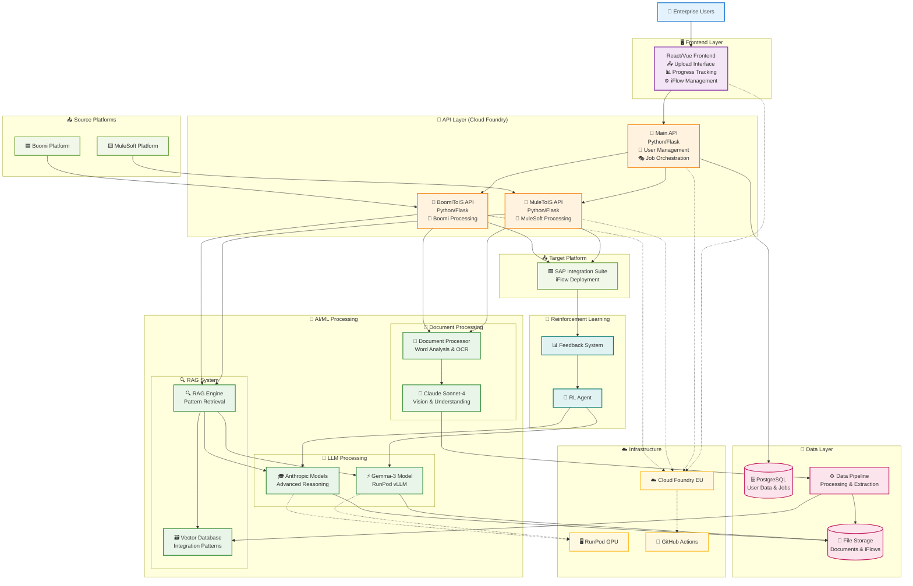
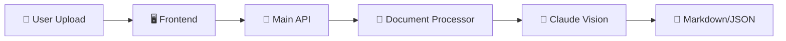
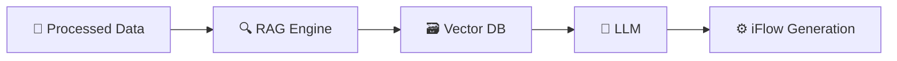
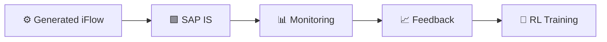
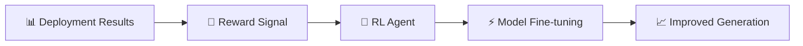

# AI Integration Flow Conversion Platform
## System Architecture Diagram

---

## 🛠️ Technology Stack

| Layer | Technology | Purpose |
|-------|------------|---------|
| **🖥️ Frontend** | React/Vue.js + Vite | User Interface & Upload |
| | TailwindCSS + SCSS | Styling & Design |
| | Redux Toolkit | State Management |
| **🔗 API Layer** | Python 3.9 + Flask | Backend Services |
| | JWT Authentication | Security |
| | Cloud Foundry | Deployment Platform |
| **🤖 AI/ML** | Anthropic Claude Sonnet-4 | Primary LLM |
| | Gemma-3 on RunPod | Secondary LLM |
| | ChromaDB/Pinecone | Vector Database |
| | LangChain | RAG Framework |
| **💾 Data** | PostgreSQL | Primary Database |
| | Cloud Storage | File Management |
| | Pandas + NumPy | Data Processing |
| **🔌 Integration** | Boomi AtomSphere API | Source Platform |
| | MuleSoft Anypoint API | Source Platform |
| | SAP Integration Suite | Target Platform |
| **☁️ Infrastructure** | Cloud Foundry EU | Hosting |
| | RunPod GPU | AI Compute |
| | GitHub Actions | CI/CD |

---

## 🔄 Data Flow Patterns

### 📤 **Document Upload & Processing**

### ⚙️ **Integration Flow Conversion**

### 🚀 **Deployment & Feedback**

### 🔄 **Reinforcement Learning Loop**

---

## 🎯 Key Features

- **🔄 Multi-Platform Support**: Boomi & MuleSoft to SAP IS conversion
- **🤖 AI-Powered**: Advanced LLMs for intelligent conversion
- **📄 Document Processing**: Word docs with technical diagrams
- **🔍 RAG System**: Context-aware pattern matching
- **🎯 Reinforcement Learning**: Continuous improvement from feedback
- **☁️ Enterprise-Ready**: Cloud Foundry deployment with auto-scaling
- **🔒 Secure**: JWT authentication and enterprise compliance
