# Boomi to SAP Integration Suite Conversion Flow

This diagram illustrates the complete process of converting Dell Boomi integration files to SAP Integration Suite iFlows.

## Use Case: Stripe Subscription to Salesforce Opportunity Creation

**Business Scenario**: Every time a customer creates a new subscription in Stripe, automatically generate a corresponding Opportunity record in Salesforce to track the sales pipeline and revenue potential.

**Integration Flow**:
- **Trigger**: Stripe webhook sends new subscription event data
- **Processing**: Transform Stripe subscription data (plan, amount, customer details) to Salesforce Opportunity format
- **Action**: Create new Opportunity record in Salesforce with subscription value and customer information
- **Error Handling**: Retry logic and notification mechanisms for failed opportunity creation

**Key Components**:
- **HTTP Connector**: Receives Stripe subscription webhook payload
- **Data Mapping**: Maps Stripe subscription fields (plan name, amount, customer details) to Salesforce Opportunity fields
- **Salesforce Connector**: Creates Opportunity record via Salesforce API with subscription value
- **Error Handling**: Groovy scripts for retry logic and success/failure notifications

## Process

```mermaid
flowchart TD
    A[📁 Boomi ZIP File Upload<br/>Stripe Subscription → SF Opportunity] --> B[🔍 Extract & Parse XML Files]
    B --> C{📋 XML Component Analysis}
    C --> D[🔧 Map Components<br/>HTTP, Salesforce, Groovy]
    C --> E[🔗 Identify Connections<br/>Subscription Webhook → Transform → SF API]
    C --> F[📊 Extract Business Logic<br/>Subscription to Opportunity Mapping]

    D --> G[🤖 AI Enhancement with LLM<br/>Intelligent Business Logic Analysis]
    E --> G
    F --> G

    G --> H[📝 Generate Enhanced Documentation<br/>Business Logic & Error Handling]
    H --> I[🎯 Generate SAP iFlow Button]

    I --> J[🟢 BoomiToIS-API<br/>Specialized Boomi Processing]

    J --> K[🧠 Boomi Component Mapping<br/>Subscription Webhook → OData Adapters]
    K --> L[🏗️ Generate iFlow JSON<br/>SAP Integration Suite Format]
    L --> M[🔄 JSON to XML Conversion<br/>.iflw Package Structure]
    M --> N[📦 Create Deployable Package<br/>Ready for SAP BTP]

    N --> O[☁️ Deploy to SAP Integration Suite<br/>Automated Deployment]
    O --> P[✅ Live Integration Flow<br/>New Subscriptions → Opportunities]

    style A fill:#e1f5fe
    style G fill:#f3e5f5
    style J fill:#e8f5e8
    style O fill:#fff3e0
    style P fill:#e8f5e8

    classDef apiBox fill:#fff2cc,stroke:#d6b656,stroke-width:2px
    classDef processBox fill:#d5e8d4,stroke:#82b366,stroke-width:2px
    classDef aiBox fill:#f3e5f5,stroke:#9c27b0,stroke-width:2px

    class J apiBox
    class K,L,M,N processBox
    class G aiBox
```

## Process Stages

### 📥 **Input Stage**
- **Boomi ZIP Upload**: User uploads exported Boomi integration files containing XML components
- **XML Extraction**: System extracts and parses individual XML component files from the ZIP archive

### 🔍 **Analysis Stage** 
- **Component Analysis**: Identifies connectors, transformations, routing logic, and data mappings
- **Connection Mapping**: Maps data flow and dependencies between components
- **Business Logic Extraction**: Captures integration patterns, error handling, and business rules

### 🤖 **AI Enhancement Stage**
- **LLM Processing**: Advanced AI analyzes the integration logic and enhances documentation
- **Documentation Generation**: Creates comprehensive markdown documentation with intelligent insights

### 🔀 **Boomi Processing Stage**
- **BoomiToIS-API**: Specialized service for Dell Boomi integration conversion
- **Component Recognition**: Identifies Boomi-specific components like HTTP connectors, Salesforce connectors, and Groovy scripts
- **Business Logic Analysis**: Understands Stripe webhook processing and Salesforce opportunity creation patterns

### 🏗️ **Conversion Stage**
- **Component Mapping**: Maps Boomi components to SAP Integration Suite equivalents:
  - **HTTP Connector** → **HTTP Adapter** (for Stripe webhook reception)
  - **Salesforce Connector** → **OData Adapter** (for Salesforce API calls)
  - **Groovy Scripts** → **Message Mapping** (for data transformation)
- **JSON Generation**: Creates iFlow structure with proper SAP Integration Suite components
- **XML Conversion**: Transforms JSON to SAP-compatible .iflw format
- **Package Creation**: Builds deployable package with all necessary artifacts

### ☁️ **Deployment Stage**
- **SAP Integration Suite**: Deploys the converted iFlow to SAP BTP tenant
- **Live Integration**: Stripe payments automatically create Salesforce opportunities
- **Monitoring**: Real-time tracking of payment-to-opportunity conversions in SAP BTP

## Key Features

- **Boomi-Specific Processing**: Specialized handling of Dell Boomi integration patterns
- **AI-Enhanced Documentation**: Advanced LLM provides intelligent analysis of business logic
- **Template-Based Mapping**: Uses predefined templates for accurate Boomi-to-SAP component conversion
- **Real-World Use Cases**: Handles complex scenarios like Stripe-to-Salesforce integrations
- **Cloud-Native Deployment**: All services deployed on Cloud Foundry for scalability
- **End-to-End Automation**: From Boomi ZIP upload to SAP deployment with minimal manual intervention

## Technical Architecture

- **Frontend**: React.js application with Vite build system and platform-aware routing
- **Main API**: Python Flask application handling file processing and orchestration
- **BoomiToIS-API**: Specialized service for Boomi to SAP Integration Suite conversion
- **AI Service**: Advanced LLM integration for documentation enhancement and business logic analysis
- **SAP BTP Integration**: Direct deployment to SAP Integration Suite tenants
- **Deployment**: Cloud Foundry platform with environment-specific configurations

## Real-World Impact

This solution transforms complex Boomi integrations like **Stripe payment processing** into **SAP-native iFlows**, enabling organizations to:
- **Modernize Integration Architecture**: Move from Boomi to SAP Integration Suite
- **Maintain Business Continuity**: Preserve existing integration logic and error handling
- **Leverage SAP Ecosystem**: Utilize SAP BTP monitoring, security, and governance features
- **Accelerate Migration**: Automated conversion reduces manual effort by 80%+

The **Stripe-to-Salesforce** use case demonstrates how payment webhooks, data transformations, and CRM updates are seamlessly converted to SAP Integration Suite components while preserving the original business logic and error handling mechanisms.
