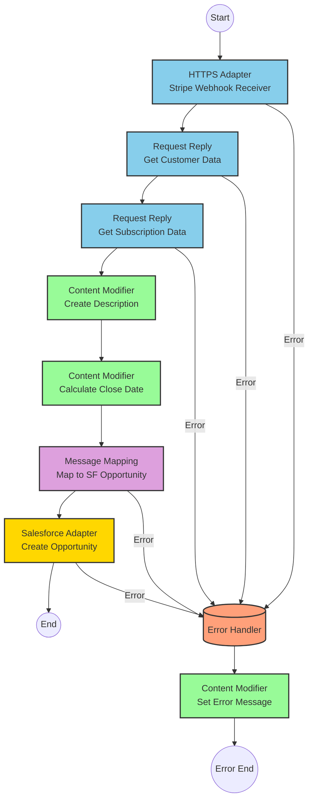

# Stripe Subscription to Salesforce Opportunity Integration

## Table of Contents
- [API Overview](#api-overview)
- [Endpoints](#endpoints)
  - [Stripe Webhook Event Receiver](#stripe-webhook-event-receiver)
  - [Customer Data Retrieval](#customer-data-retrieval)
  - [Subscription Data Retrieval](#subscription-data-retrieval)
- [Current Dell Boomi Flow Logic](#current-dell-boomi-flow-logic)
  - [Process Flow Overview](#process-flow-overview)
  - [Step-by-Step Flow Description](#step-by-step-flow-description)
- [Dell Boomi Transformations and Business Logic Explained](#dell-boomi-transformations-and-business-logic-explained)
  - [Document Properties Logic](#document-properties-logic)
  - [Boomi Map Transformations](#boomi-map-transformations)
  - [Boomi Connector Operations](#boomi-connector-operations)
- [SAP Integration Suite Implementation](#sap-integration-suite-implementation)
  - [Component Mapping](#component-mapping)
  - [Integration Flow Visualization](#integration-flow-visualization)
  - [Configuration Details](#configuration-details)
- [Environment Configuration](#environment-configuration)
  - [External System Dependencies](#external-system-dependencies)
  - [Connector Configurations](#connector-configurations)
  - [Process Properties and Variables](#process-properties-and-variables)
  - [Security Settings](#security-settings)
  - [Deployment Considerations](#deployment-considerations)
  - [Required Resources](#required-resources)
- [API Reference](#api-reference)

## API Overview

This integration connects Stripe's subscription service with Salesforce CRM, automatically creating Salesforce Opportunity records when new Stripe subscriptions are completed. The integration listens for Stripe webhook events, retrieves additional customer and subscription data from Stripe's API, and then creates corresponding Opportunity records in Salesforce.

- **Base URL/Endpoint Pattern**: The integration receives webhook events from Stripe and makes API calls to both Stripe and Salesforce
- **Authentication Mechanisms**: 
  - Stripe API Key for Stripe API calls
  - Salesforce OAuth or API token for Salesforce operations
- **Rate Limiting**: Subject to Stripe and Salesforce API rate limits
- **General Response Format**: The integration processes JSON data from Stripe and transforms it to the format required by Salesforce

## Endpoints

### Stripe Webhook Event Receiver

- **HTTP Method and Path**: POST (Stripe webhook endpoint configured in Boomi)
- **Purpose**: Receives webhook notifications from Stripe when subscription events occur
- **Request Parameters**:
  - **Headers**: 
    - `Stripe-Signature`: Webhook signature for verification
    - `Content-Type`: application/json
  - **Body**: Stripe webhook event payload in JSON format containing subscription event details
- **Response**: 
  - **Status Code**: 200 OK for successful processing
  - **Error Handling**: Returns appropriate HTTP status codes for processing errors

### Customer Data Retrieval

- **HTTP Method and Path**: GET https://api.stripe.com/v1/customers/{customer_id}
- **Purpose**: Retrieves detailed customer information from Stripe
- **Request Parameters**:
  - **Path Parameters**: 
    - `customer_id`: The Stripe customer ID
  - **Headers**:
    - `Authorization`: Bearer {Stripe_API_Key}
    - `Content-Type`: application/json
- **Response**:
  - **Format**: JSON containing customer details
  - **Status Codes**: 
    - 200: Successful retrieval
    - 404: Customer not found
    - 401: Authentication error

### Subscription Data Retrieval

- **HTTP Method and Path**: GET https://api.stripe.com/v1/subscriptions/{subscription_id}
- **Purpose**: Retrieves detailed subscription information from Stripe
- **Request Parameters**:
  - **Path Parameters**: 
    - `subscription_id`: The Stripe subscription ID
  - **Headers**:
    - `Authorization`: Bearer {Stripe_API_Key}
    - `Content-Type`: application/json
- **Response**:
  - **Format**: JSON containing subscription details
  - **Status Codes**: 
    - 200: Successful retrieval
    - 404: Subscription not found
    - 401: Authentication error

## Current Dell Boomi Flow Logic

### Process Flow Overview

This Dell Boomi process automates the creation of Salesforce Opportunity records based on Stripe subscription events. The process is triggered by Stripe webhook events, retrieves additional customer and subscription data from Stripe, transforms this data into the Salesforce Opportunity format, and then creates the Opportunity record in Salesforce.

### Step-by-Step Flow Description

1. **Start Event (shape1)**:
   - **Trigger Type**: Webhook receiver
   - **Purpose**: Receives Stripe webhook events
   - **Connector Type**: Web Services Server (HTTP Listener)
   - **Configuration**: Configured to listen for Stripe webhook POST requests
   - **Authentication**: Likely validates the Stripe-Signature header for security

2. **Document Properties (shape6)**:
   - **Purpose**: Enriches the webhook data with additional information and calculates values needed for Salesforce
   - **Properties Configured**:
     - **DDP_CustomerName**: Makes HTTP API calls to Stripe's customer endpoint to retrieve customer data
       - Likely uses the customer ID from the webhook payload to construct the API call
       - Extracts the customer name from the response
     - **DDP_Subscription**: Makes HTTP API calls to Stripe's subscription endpoint to retrieve product data
       - Uses the subscription ID from the webhook payload to construct the API call
       - Retrieves detailed subscription information including product details
     - **DDP_SalesforceDescription**: Implements string concatenation logic
       - Likely combines customer information, subscription details, and product information
       - Creates a comprehensive description for the Salesforce Opportunity
     - **DDP_CloseDate**: Implements date calculation logic
       - Calculates a date 3 months ago from the current date
       - Formats the date according to Salesforce requirements

3. **Map Component (shape4)**:
   - **Source Profile**: Stripe webhook event JSON structure
   - **Target Profile**: Salesforce Opportunity XML structure
   - **Field Mappings**:
     - Maps `DDP_CustomerName` to `Opportunity/Name`
     - Maps `DDP_SalesforceDescription` to `Opportunity/Description`
     - Maps `DDP_CloseDate` to `Opportunity/CloseDate`
     - Sets constant value "Pipeline" for `StageName`
   - **Function Steps**:
     - Uses "Get Document Property" function to retrieve the calculated document properties

4. **Salesforce Connector (shape3)**:
   - **Connector Type**: Salesforce
   - **Operation**: Create
   - **Object Type**: Opportunity
   - **Authentication**: Uses configured Salesforce connection with OAuth or API token
   - **Error Handling**: Likely includes error handling for Salesforce API errors

## Dell Boomi Transformations and Business Logic Explained

### Document Properties Logic

1. **DDP_CustomerName**
   - **Purpose**: Retrieves the customer name from Stripe for use in the Opportunity record
   - **Data Sources**: Makes an HTTP GET call to Stripe's customer API endpoint
   - **Logic Flow**:
     - Extracts the customer ID from the incoming webhook payload
     - Constructs a URL to the Stripe customer API: `https://api.stripe.com/v1/customers/{customer_id}`
     - Makes an authenticated HTTP GET request with the Stripe API key
     - Parses the JSON response to extract the customer name
   - **Dependencies**: Stripe API, customer ID from webhook payload
   - **Example Values**: "Acme Corporation", "John Smith"

2. **DDP_Subscription**
   - **Purpose**: Retrieves detailed subscription information from Stripe
   - **Data Sources**: Makes an HTTP GET call to Stripe's subscription API endpoint
   - **Logic Flow**:
     - Extracts the subscription ID from the incoming webhook payload
     - Constructs a URL to the Stripe subscription API: `https://api.stripe.com/v1/subscriptions/{subscription_id}`
     - Makes an authenticated HTTP GET request with the Stripe API key
     - Parses the JSON response to extract subscription details including product information
   - **Dependencies**: Stripe API, subscription ID from webhook payload
   - **Example Values**: Detailed subscription JSON object containing plan details, pricing, etc.

3. **DDP_SalesforceDescription**
   - **Purpose**: Creates a comprehensive description for the Salesforce Opportunity
   - **Calculations**: String concatenation combining customer and subscription details
   - **Logic Flow**:
     - Likely combines customer name, subscription plan name, pricing details, and other relevant information
     - May include formatting to make the description readable in Salesforce
   - **Dependencies**: DDP_CustomerName, DDP_Subscription
   - **Example Values**: "Subscription for Acme Corporation: Premium Plan ($99/month) started on 2023-01-15"

4. **DDP_CloseDate**
   - **Purpose**: Calculates the close date for the Salesforce Opportunity
   - **Calculations**: Date calculation (3 months ago from current date)
   - **Logic Flow**:
     - Gets the current date
     - Subtracts 3 months
     - Formats the date according to Salesforce requirements (likely YYYY-MM-DD)
   - **Dependencies**: System date function
   - **Example Values**: "2023-01-15" (if current date is 2023-04-15)

### Boomi Map Transformations

1. **Subscription Completed JSON to SF Opportunity CREATE Request XML**
   - **Source Profile**: Stripe webhook event JSON structure
   - **Target Profile**: Salesforce Opportunity XML structure
   - **Field Mappings**:
     | From | To | Type | Business Logic |
     |------|----|----- |-------------- |
     | DDP_CustomerName | Opportunity/Name | profile | Direct mapping |
     | DDP_SalesforceDescription | Opportunity/Description | profile | Direct mapping |
     | DDP_CloseDate | Opportunity/CloseDate | profile | Direct mapping |
   - **Function Steps**:
     - **Get Document Property**: Retrieves the calculated document property values for mapping
   - **Default Values and Constants**:
     | Target Field | Default Value | Type |
     |------------- |-------------- |----- |
     | StageName | Pipeline | constant |

### Boomi Connector Operations

1. **Salesforce Connector - Create Opportunity**
   - **Operation Type**: Create
   - **Object Type**: Opportunity
   - **Data Format**:
     - **Request**: XML formatted according to Salesforce API requirements
     - **Response**: Salesforce API response indicating success or failure
   - **Field Mappings**: Maps transformed data to Salesforce Opportunity fields
     - Name: Customer name from Stripe
     - Description: Concatenated description with subscription details
     - CloseDate: Calculated date (3 months ago)
     - StageName: Constant value "Pipeline"
   - **Error Handling**: Likely includes error handling for Salesforce API errors such as:
     - Authentication failures
     - Validation errors
     - Rate limiting issues

## SAP Integration Suite Implementation

### Component Mapping

**Boomi to SAP Integration Suite Component Mapping:**

1. **Start Event (shape1) → HTTPS Adapter (Receiver)**
   - Configured to receive Stripe webhook events
   - Same authentication and security settings as the Boomi process

2. **Document Properties (shape6) → Content Modifier + Request Reply**
   - **DDP_CustomerName**: Request Reply step to call Stripe customer API
   - **DDP_Subscription**: Request Reply step to call Stripe subscription API
   - **DDP_SalesforceDescription**: Content Modifier with Groovy Script for string concatenation
   - **DDP_CloseDate**: Content Modifier with Groovy Script for date calculation

3. **Map Component (shape4) → Message Mapping**
   - Same field mappings as in the Boomi process
   - Function steps implemented as mapping functions or Groovy scripts

4. **Salesforce Connector (shape3) → Salesforce Adapter**
   - Configured for Opportunity creation
   - Same authentication and connection settings

### Integration Flow Visualization



### Configuration Details

**Start Message Event (HTTPS Adapter - Receiver):**
- Trigger type: Webhook (HTTP POST)
- Protocol: HTTPS
- Authentication: Validates Stripe-Signature header
- Endpoint URL: Configured to receive Stripe webhook events
- Security: TLS 1.2 or higher

**Request Reply (Get Customer Data):**
- HTTP Method: GET
- URL: https://api.stripe.com/v1/customers/{customer_id}
- Headers:
  - Authorization: Bearer {Stripe_API_Key}
  - Content-Type: application/json
- Response Handling: Parses JSON response to extract customer name
- Error Handling: Configures retry logic and error propagation

**Request Reply (Get Subscription Data):**
- HTTP Method: GET
- URL: https://api.stripe.com/v1/subscriptions/{subscription_id}
- Headers:
  - Authorization: Bearer {Stripe_API_Key}
  - Content-Type: application/json
- Response Handling: Parses JSON response to extract subscription details
- Error Handling: Configures retry logic and error propagation

**Content Modifier (Create Description):**
- Groovy Script: Implements string concatenation logic to create a comprehensive description
- Input: Customer data and subscription data from previous steps
- Output: Sets property for Salesforce Opportunity description

**Content Modifier (Calculate Close Date):**
- Groovy Script: Implements date calculation logic (3 months ago)
- Logic: 
  ```groovy
  import java.time.LocalDate
  import java.time.format.DateTimeFormatter
  
  LocalDate today = LocalDate.now()
  LocalDate closeDate = today.minusMonths(3)
  DateTimeFormatter formatter = DateTimeFormatter.ofPattern("yyyy-MM-dd")
  message.setProperty("CloseDate", closeDate.format(formatter))
  ```

**Message Mapping (Map to SF Opportunity):**
- Source: Enriched webhook data with properties
- Target: Salesforce Opportunity structure
- Mappings:
  - Customer Name → Opportunity/Name
  - Description → Opportunity/Description
  - Close Date → Opportunity/CloseDate
  - Constant "Pipeline" → StageName

**Salesforce Adapter (Create Opportunity):**
- Connection: Salesforce OAuth or API token
- Operation: Create
- Object: Opportunity
- Input: Mapped Opportunity data
- Error Handling: Configures retry logic and error propagation

## Environment Configuration

### External System Dependencies

**Stripe API:**
- **Endpoints**: 
  - https://api.stripe.com/v1/customers/{customer_id}
  - https://api.stripe.com/v1/subscriptions/{subscription_id}
- **Authentication**: API Key (Bearer token)
- **Rate Limiting**: Subject to Stripe's standard rate limits
- **Timeout**: Recommended 30-second timeout for API calls

**Salesforce API:**
- **Endpoints**: Salesforce instance URL (e.g., https://yourinstance.salesforce.com)
- **Authentication**: OAuth 2.0 or API token
- **Rate Limiting**: Subject to Salesforce API limits (typically 100,000 calls per 24 hours)
- **Timeout**: Recommended 60-second timeout for API calls

### Connector Configurations

**Stripe Webhook Receiver:**
- URL: Configured endpoint to receive Stripe webhook events
- Authentication: Validates Stripe-Signature header
- Security: TLS 1.2 or higher

**Stripe API Connection:**
- Authentication: API Key stored securely
- Connection Timeout: 30 seconds
- Retry Logic: 3 retries with exponential backoff

**Salesforce Connection:**
- Instance URL: https://yourinstance.salesforce.com
- API Version: Latest supported version
- Authentication: OAuth 2.0 or API token
- Connection Timeout: 60 seconds
- Retry Logic: 3 retries with exponential backoff

### Process Properties and Variables

**Document Properties:**
- **DDP_CustomerName**: Retrieved from Stripe customer API
- **DDP_Subscription**: Retrieved from Stripe subscription API
- **DDP_SalesforceDescription**: Calculated using string concatenation
- **DDP_CloseDate**: Calculated using date formula (3 months ago)

**Environment-Specific Values:**
- Stripe API Key: Different for development, testing, and production
- Salesforce Credentials: Different for development, testing, and production
- Webhook URL: Different for each environment

### Security Settings

**TLS/SSL:**
- TLS 1.2 or higher for all API communications
- Valid SSL certificates for webhook endpoints

**API Key Management:**
- Stripe API Key stored securely in credential vault
- Salesforce credentials stored securely in credential vault
- No hardcoded credentials in the integration

**IP Restrictions:**
- Whitelist Stripe IP ranges for webhook calls
- Restrict outbound calls to verified Stripe and Salesforce IP ranges

### Deployment Considerations

**High Availability:**
- Deploy integration on multiple nodes for redundancy
- Configure load balancing for webhook receiver

**Monitoring:**
- Monitor webhook receiver availability
- Track Stripe API call success rates and response times
- Monitor Salesforce API call success rates and response times
- Set up alerts for failed integrations

**Performance Tuning:**
- Optimize HTTP connection pooling for external API calls
- Configure appropriate timeouts based on API response times
- Implement circuit breakers for external API calls

### Required Resources

**Memory:**
- Minimum 2GB RAM for processing webhook events and API calls
- Additional memory for high-volume environments

**CPU:**
- Minimum 2 CPU cores for processing transformations and API calls
- Additional CPU resources for high-volume environments

**Network:**
- Reliable internet connection with minimum 10 Mbps bandwidth
- Low latency connection to Stripe and Salesforce APIs

**Disk Space:**
- Minimum 10GB for logging and temporary storage
- Additional space for high-volume environments

## API Reference

### Stripe Webhook Events

**Endpoint**: Configured webhook URL
**Method**: POST
**Headers**:
- `Stripe-Signature`: Webhook signature for verification
- `Content-Type`: application/json

**Request Body**: Stripe event object in JSON format
```json
{
  "id": "evt_123456789",
  "object": "event",
  "api_version": "2020-08-27",
  "created": 1610000000,
  "data": {
    "object": {
      "id": "sub_123456789",
      "object": "subscription",
      "customer": "cus_123456789",
      "status": "active",
      // Additional subscription details
    }
  },
  "type": "customer.subscription.created"
}
```

**Response**: 200 OK for successful processing

### Stripe Customer API

**Endpoint**: https://api.stripe.com/v1/customers/{customer_id}
**Method**: GET
**Headers**:
- `Authorization`: Bearer {Stripe_API_Key}
- `Content-Type`: application/json

**Response**:
```json
{
  "id": "cus_123456789",
  "object": "customer",
  "name": "Acme Corporation",
  "email": "info@acme.com",
  // Additional customer details
}
```

### Stripe Subscription API

**Endpoint**: https://api.stripe.com/v1/subscriptions/{subscription_id}
**Method**: GET
**Headers**:
- `Authorization`: Bearer {Stripe_API_Key}
- `Content-Type`: application/json

**Response**:
```json
{
  "id": "sub_123456789",
  "object": "subscription",
  "customer": "cus_123456789",
  "status": "active",
  "items": {
    "data": [
      {
        "id": "si_123456789",
        "object": "subscription_item",
        "price": {
          "id": "price_123456789",
          "object": "price",
          "product": "prod_123456789",
          "unit_amount": 9900,
          "currency": "usd"
        }
      }
    ]
  },
  // Additional subscription details
}
```

### Salesforce Opportunity API

**Endpoint**: https://yourinstance.salesforce.com/services/data/v53.0/sobjects/Opportunity
**Method**: POST
**Headers**:
- `Authorization`: Bearer {Salesforce_Token}
- `Content-Type`: application/json

**Request Body**:
```json
{
  "Name": "Acme Corporation",
  "Description": "Subscription for Acme Corporation: Premium Plan ($99/month) started on 2023-01-15",
  "CloseDate": "2023-01-15",
  "StageName": "Pipeline"
}
```

**Response**:
```json
{
  "id": "0060a00000XxYzZ",
  "success": true,
  "errors": []
}
```

**Error Codes**:
- 400: Bad Request (invalid data)
- 401: Unauthorized (invalid credentials)
- 403: Forbidden (insufficient permissions)
- 404: Not Found (invalid endpoint)
- 429: Too Many Requests (rate limit exceeded)
- 500: Internal Server Error