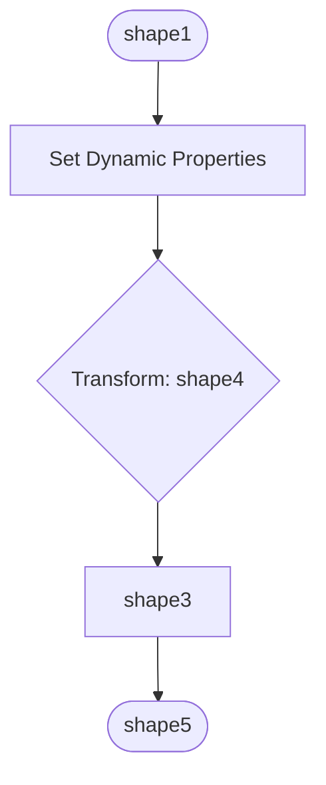

# Dell Boomi Integration Documentation

**Generated on:** 2025-06-24 06:33:46

## Summary

- **Total Files Processed:** 1
- **Processes:** 1
- **Maps:** 0
- **Connectors:** 0

## Dell Boomi Processes

### 1. Create Salesforce Opportunities from Stripe Subscriptions

**Description:** For more details, see here: https://community.boomi.com/s/article/Create-Salesforce-Opportunities-from-Stripe-Subscriptions

#### Component Information

- **Type:** process
- **Version:** 1
- **Created By:** deepan@itresonance.com
- **Folder Path:** IT Resonance/Create Salesforce Opportunities from Stripe Subscriptions_2025-06-05-11:22:02

#### Integration Patterns

- Event Listener
- Data Sender
- Dynamic Properties

#### Detailed Process Flow Analysis

**Step 1:  (shape1)**

- **Type**: Process trigger/start event

**Step 2:  (shape3)**

- **Type**: Connector Action
- **Action Type**: Send
- **Connector Type**: salesforce
- **System**: Salesforce
- **Purpose**: Create or update records in Salesforce
- **Authentication**: OAuth 2.0
- **API Type**: REST API

**Step 3:  (shape4)**

- **Type**: Data Mapping/Transformation
- **Purpose**: Data transformation

**Step 4:  (shape5)**

- **Type**: Process completion/end event
- **Purpose**: Completes the integration process

**Step 5: Set Dynamic Properties (shape6)**

- **Type**: Document Properties (Dynamic Property Setting)
- **Properties Configured**:
  - **Dynamic Document Property - DDP_CustomerName**: Makes HTTP API calls and performs string concatenations
    - **External API Calls**:
      - Retrieve customer name using customer ID
      - Endpoint: Customer API - Get customer details
    - **String Operations**:
      - Concatenate: {connector} + {profile}
      - Pattern: {connector} + {profile}
  - **Dynamic Document Property - DDP_Subscription**: Makes HTTP API calls and performs string concatenations
    - **External API Calls**:
      - Retrieve product name using product ID
      - Endpoint: Product API - Get product details
    - **String Operations**:
      - Concatenate: {connector} + {profile}
      - Pattern: {connector} + {profile}
  - **Dynamic Document Property - DDP_SalesforceDescription**: String concatenation: Concatenate: {Property: Dynamic Document Property - DDP_CustomerName} + "has subscribed to: " + {Property: Dynamic Document Property - DDP_Subscription}
    - **String Operations**:
      - Concatenate: {Property: Dynamic Document Property - DDP_CustomerName} + "has subscribed to: " + {Property: Dynamic Document Property - DDP_Subscription}
      - Pattern: {Property: Dynamic Document Property - DDP_CustomerName} + "has subscribed to: " + {Property: Dynamic Document Property - DDP_Subscription}
  - **Dynamic Document Property - DDP_CloseDate**: Calculates date: Relative date calculation
    - **Calculations**:
      - Relative date calculation
      - Calculate date by subtracting 3 months from current date

#### Process Flow Diagram

